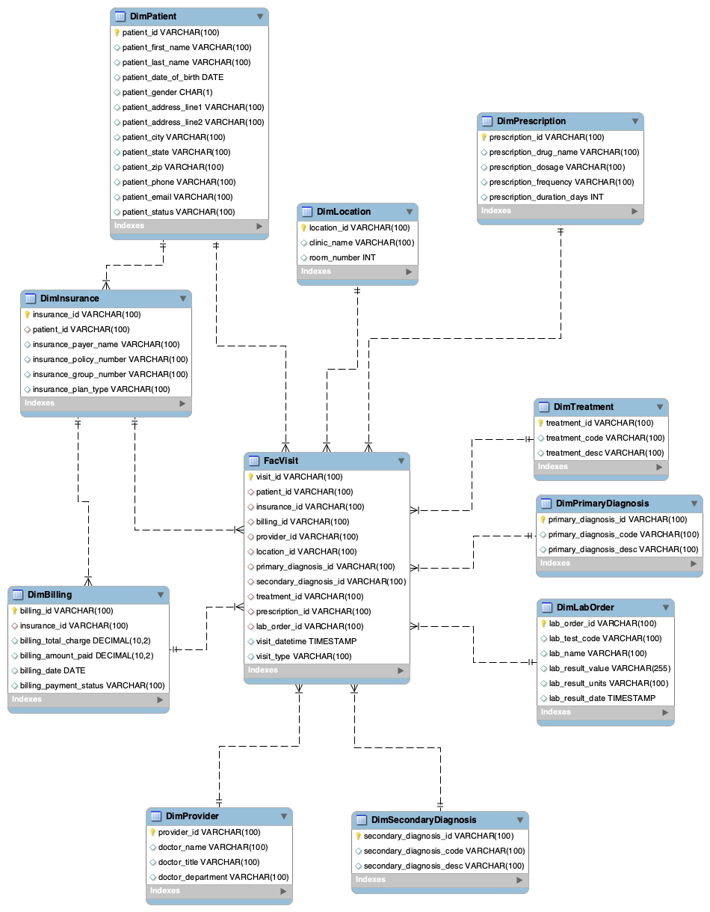
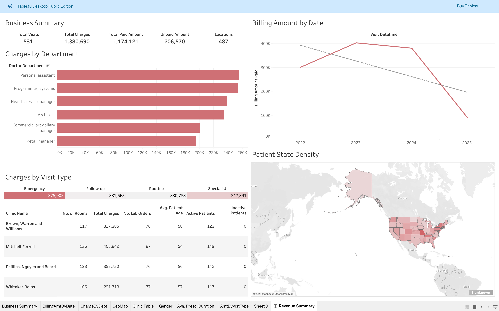

# Healthcare Data Normalization and Vizualization

## Description
In this project, we implement a data normalization process where we take a flat structured synthetic dataset in csv form and normalize it to a snowflake schema relational model. The data is migrated from the csv into a MySQL database. Using this relational model, we load the data into tableau public and generate a business vizualization dashboard for further business analytics.

## Dataset
This dataset contains synthetic healthcare records for 531 patient visits to a legacy healthcare system. It comprises 47 columns, capturing detailed information across various domains such as:

- Patient Demographics: Name, date of birth, gender, contact details, and address.
- Visit Details: Visit date, type, doctor information, department, clinic, and room number.
- Billing Information: Total charges, payments made, billing dates, and payment status.
- Insurance Details: Insurance provider, policy number, group number, and plan type.
- Medical Records: Diagnoses (primary and secondary), treatment codes and descriptions.
- Prescriptions: Drug name, dosage, frequency, and duration (if prescribed).
- Laboratory Results: Ordered tests, values, units, and result dates (if applicable).

## Prerequisites
- Python 3.12
- OpenJDK 17
- MySQL 9.0.1
- Tableau Public

## Installation
### Clone git repository
```
git clone https://github.com/rahulkfernandes/Healthcare-Data-Normalization-and-Vizualization.git
```

### Install dependecies
```
pip install -r requirements.txt
```

### Required Connectors
- Download MySQL Connector/J (9.1.0) and save the jar file in an appropriate directory and add the path do your .env file

### Setting Up Environment Variables
1. Create your local environment file:
```
cp .env.example .env
```

2. Update the .env file with your database credentials and paths

## Usage
Ensure the MySQL Database server is running.

### To run Normalization and Migration
```
python src/main.py
```

## Snowflake Schema


## Dashboard
